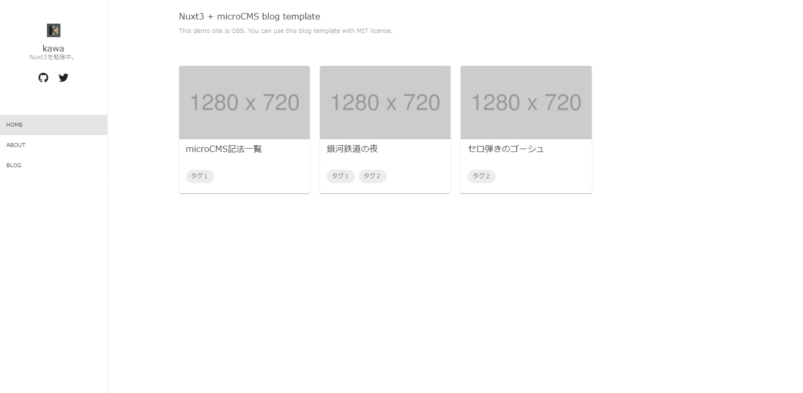

# Nuxt3-microCMS Blog Template

[デモサイト](https://nuxt3-microcms-blog.kinomama.tech/)



[Nuxt3](https://v3.nuxtjs.org) + [microCMS](https://microcms.io/) + [Vuetify3](https://next.vuetifyjs.com/en/)で作られたブログテンプレートです。

`Use this template`から自分のリポジトリを作って利用します。

## How to use

### 1. Use this template
- このリポジトリのページ上にある`Use this template`をクリック
- repository name, description, Public/Privateを設定
- `Create repository from template`をクリック
### 2. Setup microCMS
- microCMS の[公式ページ](https://microcms.io/)からアカウントを作成
- microCMSにログインし、以下のテーブルのように[サービスを作成](https://document.microcms.io/manual/create-service)

| サービス名 | サービスID |
| --- | --- |
| 任意 | 任意 |

- microCMSで以下のテーブルのように[APIの作成](https://document.microcms.io/manual/create-api)（microCMSには[APIインターフェースのインポート機能](https://document.microcms.io/manual/export-and-import-api-schema#hf95e7cc83a)があるので、APIの型を設定したのち、以下のテーブルのインポートファイルの欄にあるファイルを使用してください）

| API名 | エンドポイント | APIの型 | インポートファイル |
| --- | --- | --- | --- |
| 任意（例：サイト情報） | base-info | オブジェクト形式 | [api-base-info.json](docs/api-base-info.json) |
| 任意（例：ブログ） | blog | リスト形式 | [api-blog.json](docs/api-blog.json) |

- 前手順で作成したAPIスキーマに従ってサイト情報やブログコンテンツを作成

### 3. Environment variables (local environment)

- `.env.template`をコピーし、`.env`を作成
- `BASE_URL`を上記の手順で作成したmicroCMSのサービスIDに、`API_KEY`をAPIキーに設定
### 4. Install packages
パッケージをインストール
```bash
yarn install
```

### 5. Development
ローカル環境での動作確認
```bash
yarn dev
```
### 6. Production
本番モードでの動作確認
```bash
yarn build
```

### 7. Environment variables (server environment)
#### [Netfily](https://www.netlify.com/)での環境変数の設定
- NetlifyのDeploy設定のEnvironment variablesセクションに手順3と同様の環境変数を設定

| key | value |
| --- | --- |
| BASE_URL | [サービスID] |
| API_KEY | [APIキー] |

### 8. Deploy
- Githubのリポジトリに更新があると自動的にNetlifyにデプロイ


